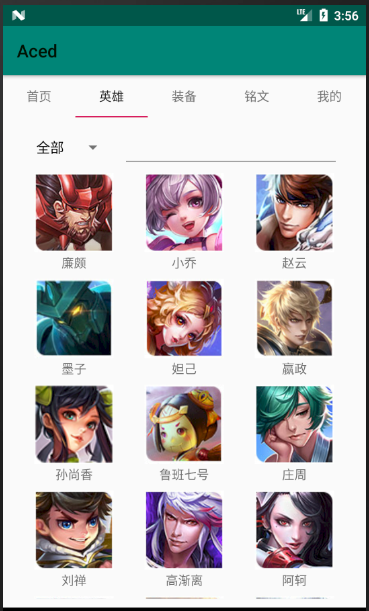

# 中山大学数据科学与计算机学院本科生实验报告
## （2018年秋季学期）
| 课程名称 | 手机平台应用开发 | 任课老师 | 郑贵锋 |
| :------------: | :-------------: | :------------: | :-------------: |
| 年级 | 2016级 | 专业（方向） | 软件工程（计算机应用） |
| 学号 | 16340296 | 姓名 | 张子权 |
| 电话 | 13415401985 | Email | ziquanzhang@126.com |
| 开始日期 | 2018/11/12 | 完成日期 | 2018/11/19 |

---

## 一、实验题目

王者荣耀英雄大全

---

## 二、实现内容

1. 对APP的分页，划分几个区块分别为首页、英雄、符文、我的，便于分工。
2. 在英雄和符文界面上增加搜索以及分类功能，便于搜索某个特定的符文。
3. 完成符文的适配器进行列表显示。
4. 建立数据库英雄表和符文表，并插入所有英雄和符文。
5. 根据图片的链接实现网络连接获取图片，并显示在应用上，并保存在本地数据库中。

---

## 三、课堂实验结果

### (1)实验截图

1. APP的大致分页内容  
    

2. 英雄全列表  
    

3. 查看战士职业的英雄  
    

4. 查看战士职业并且名字中带有"钟"的英雄  
    

5. 可以根据不同的属性来进行筛选  
    

6. 搜索符文中等级4的符文  
    

7. 搜索带有冷却词缀并有某属性+2的符文  
    

8. 搜索含有暴击词缀的符文  
    

9. 搜索蓝色符文  
    

10. 插入全英雄技能描述  
    
  
### (2)实验步骤以及关键代码

* 实验步骤
    1. 划分app的各个部分进行分页操作。使用Viewpager控件进行显示，从而能够进行各个部分的切换，滑动的操作进行浏览。并且将各部分写成一个普通类，实现代码的划分，各部分传入MainActivity的context，使得能够使用应用的各种功能函数。
    关键代码：
        ```java
        private void initViewPaper() {
            _views = new ArrayList<View>();
            initViewData();
            String [] _titles  = {"首页","英雄","装备","铭文","我的"} ;
            ViewPager vp_main_content = (ViewPager)findViewById(R.id.vp_main_content);
            MyPagerAdapter myPagerAdapter = new MyPagerAdapter(this,_views,_titles);
            vp_main_content.setAdapter(myPagerAdapter);
        }
        ```
        ```java
        MinePage minePage = new MinePage(MainActivity.this);
        View viewpagerA = homePage.getView();
        ···
        public View getView(){
            LayoutInflater inflater = LayoutInflater.from(context);
            View viewpager = inflater.inflate(R.layout.vp_homepage, null);
            return viewpager;
        }
        ```
    2. 添加筛选功能便于英雄的检索以及符文的检索。使得能够通过各个方面来查询到英雄，如英雄职业，定位，攻击方式（魔法/物理）来进行查询。另外添加一个搜索框来匹配英雄的名字。增加一个下拉栏改变radiogroup的选择项，如选择定位时，圆形选择项则变为定位方面的各种划分。主要方式是当下拉栏改变时，清空圆形选项，并手动添加对应的。
    关键代码：
        ```java
        private void changeRadioGroup(int position){
            hero_group.removeAllViews();
            if(position == 0){
                _myAdapter =(MyListViewAdapter) hero_list.getAdapter();
                _myAdapter.refresh(_heros);
            }else{
                Vector selecter = _radiobuttons.get(position-1);
                for(int i = 0;i<selecter.size();i++){
                    RadioButton radioButton = new RadioButton(context);
                    radioButton.setText(selecter.get(i).toString());
                    radioButton.setWidth(hero_group.getWidth()/selecter.size());

                    hero_group.addView(radioButton);
                    if(i == 0)
                    {
                        radioButton.setChecked(true);
                    }
                }
            }
        }
        ```
        添加下拉栏事件监听器，从而进行改变。
        ```java
        ArrayAdapter<String> adapter =new ArrayAdapter<String>(context,R.layout.support_simple_spinner_dropdown_item,_heros_sift);
        adapter.setDropDownViewResource(R.layout.support_simple_spinner_dropdown_item);
        hero_sift.setOnItemSelectedListener(new Spinner.OnItemSelectedListener(){

            @Override
            public void onItemSelected(AdapterView<?> parent, View view, int position, long id) {
                changeRadioGroup(position);
            }
        ```
    3. 英雄筛选以及符文词条的匹配主要是通过整合其属性值，查询是否包含该关键字来实现的，当包含关键字时，就将这一项加入到列表之中，更新listview的显示，从而得到筛选后的结果。这样就能进行选择。在搜索栏输入时，抛弃了笨重的搜索按钮，判断搜索栏的输入是否改变来进行匹配更新，这样就无需点击搜索按钮。符文的词缀搜索匹配相类似。
    关键代码：
        ```java
        @Override
        public void afterTextChanged(Editable s) {
            search_heros();
        }
        ···
        private void search_heros(){
            RadioButton radioButton = (RadioButton) viewpager.findViewById(hero_group.getCheckedRadioButtonId());
            String checkText = "";
            if(radioButton != null){
                checkText = radioButton.getText().toString();
            }
            _selected_heros.clear();
            for(int i = 0; i<_heros.size(); i++){
                Hero temp = _heros.get(i);
                if((temp.get_type().contains(checkText) || temp.getPositon().contains(checkText) ||
                        temp.getOccupation().contains(checkText))&& temp.getName().contains(hero_search.getText().toString())){
                    _selected_heros.add(_heros.get(i));
                }
            }
            _myAdapter =(MyListViewAdapter) hero_list.getAdapter();
            _myAdapter.refresh(_selected_heros);
        }
        ```
    4. 符文显示，显示符文等级，各种增幅效果，符文图片。
        ```java
        byte[] image = list.get(i).getInscriptionImage();
        Bitmap bmp = null;
        if(image !=null)
        {
            bmp = BitmapFactory.decodeByteArray(image, 0, image.length);
        }
        viewHolder.image.setImageBitmap(bmp);
        viewHolder.name.setText(list.get(i).getInscriptionName());
        viewHolder.description.setText(list.get(i).getInscriptionDescription());
        viewHolder.grade.setText("等级"+list.get(i).getInscriptionGrade());
        ```
    5. 英雄和英雄技能的数据库表以及符文的数据库表，英雄的包含英雄id，名称，类型，头像的网络路径，还有各种能力属性。技能则是技能id，匹配的英雄，耗蓝量，冷却时间，描述还有使用的技巧。
        ```sql
                "CREATE TABLE hero (\n" +
                        "  `hero_id` int(11) NOT NULL PRIMARY KEY,\n" +
                        "  `name` TEXT DEFAULT NULL,\n" +
                        "  `pay_type` int(11) DEFAULT NULL,\n" +
                        "  `new_type` int(11) DEFAULT NULL,\n" +
                        "  `hero_type` int(11) DEFAULT NULL,\n" +
                        "  `hero_type2` int(11) DEFAULT NULL,\n" +
                        "  `skin_name` TEXT DEFAULT NULL,\n" +
                        "  `img_url` TEXT DEFAULT NULL,\n" +
                        "  `live` int(11) DEFAULT NULL,\n" +
                        "  `attack` int(11) DEFAULT NULL,\n" +
                        "  `skill` int(11) DEFAULT NULL,\n" +
                        "  `difficulty` int(11) DEFAULT NULL,\n "+
                         "  `like` int(11) DEFAULT NULL)" ;
        ```
        ```sql
        "CREATE TABLE `skill` (\n" +
                "  `skill_id` int(11) DEFAULT NULL PRIMARY KEY,\n" +
                "  `hero_id` int(11) DEFAULT NULL,\n" +
                "  `name` TEXT DEFAULT NULL,\n" +
                "  `cool` int(11) DEFAULT NULL,\n" +
                "  `waste` int(11) DEFAULT NULL,\n" +
                "  `description` TEXT ,\n" +
                "  `tips` TEXT ,\n" +
                "  `img_url` TEXT DEFAULT NULL\n" +
                ")";
        ```
    6. 添加图片，通过网络连接增加图片，考虑到重复查询会消耗大量的流量而且会浪费网络资源，没有意义，因此就弄成首先从本地数据库中获取，当本地数据库不存在时，再从通过网络访问获得图片，再保存到数据库中，从数据库访问，这样就能保证下一次的访问则会从数据库中获得了。（另外因为观察到各种图片都和id有关，因此将其链接都弄到一起，根据id，类型从不同地方获得图片）
    关键代码：
        ```java
        public byte[] queryImage(String id, int type){
        SQLiteDatabase db = this.getReadableDatabase();
        String selection = "image_id = ?";
        String[] selectionArgs = {id};
        Cursor cursor = db.query(IMAGE_TABLE,null,selection, selectionArgs,null,null,null);
        if(cursor.getCount()!=0){
            cursor.moveToNext();
            byte[] in = cursor.getBlob(cursor.getColumnIndex("image"));
            cursor.close();
            return in;
        }else {
            cursor.close();
            String url = "";
            switch (type) {
                case 0://英雄id
                    url = "http://game.gtimg.cn/images/yxzj/img201606/heroimg/"+id+"/"+id+".jpg";
                    break;
                case 1://技能id
                    url = "http://game.gtimg.cn/images/yxzj/img201606/heroimg/"+id.substring(0,id.length()-1)+"/"+id+"0.png";
                    break;
                case 2://英雄原画，英雄id
                    url = "http://game.gtimg.cn/images/yxzj/img201606/skin/hero-info/"+id.substring(1,id.length())+"/"+id.substring(1,id.length())+"-bigskin-1.jpg";
                    break;
                case 3://装备,装备id
                    url = "http://game.gtimg.cn/images/yxzj/img201606/itemimg/"+id+".jpg";
                    break;
                case 4://铭文，铭文id
                    url = "http://game.gtimg.cn/images/yxzj/img201606/mingwen/"+id.substring(1,id.length())+".png";
                    break;
            }
            try {
                Bitmap bitmap = getBitmap(url);
                if(bitmap==null){
                    return null;
                }
                ByteArrayOutputStream baos = new ByteArrayOutputStream();
                bitmap.compress(Bitmap.CompressFormat.PNG, 100, baos);
                insertImage(Integer.parseInt(id),baos.toByteArray());
                return baos.toByteArray();
            } catch (IOException e) {
                e.printStackTrace();
            }
        }
        return null;
        ```
        网络访问部分：
        ```java
        public Bitmap getBitmap(String path) throws IOException {
            try {
                URL url = new URL(path);
                HttpURLConnection conn = (HttpURLConnection) url.openConnection();
                conn.setConnectTimeout(5000);
                conn.setRequestMethod("GET");
                if (conn.getResponseCode() == 200) {
                    InputStream inputStream = conn.getInputStream();
                    Bitmap bitmap = BitmapFactory.decodeStream(inputStream);
                    return bitmap;
                }else{
                    conn.disconnect();
                }
                conn.disconnect();
            } catch (IOException e) {
                // TODO Auto-generated catch block
                e.printStackTrace();
            }
            return null;
        }
        ```

### (3)实验遇到的困难以及解决思路

* 遇到的困难
    1. 实现搜索功能时原本选择在适配器中解决，控制某一项的显示来进行，但是当实现功能了之后，发现即使变为GONE，仍会在那一个地方留下空白，后面一项并没有补上去。
    解决方案：也只能使用更改适配器里的列表来进行更新了，先在外面筛选出合适的项目，再传入适配器中，从而实现更新。这样就能保证没有空白，但是感觉效率并不会很高。若是能做到传入一个过滤词到适配器中对项目进行过滤就很好了。
    2. 进行app的分页时，原本各个部分的代码都是在MainActivity这个java文件中的，但是这样做的话就会导致这个文件过大，并且代码冗杂不好分工处理。
    解决方案：参考了一下适配器传入context以及网上的代码，考虑到可以通过传入一个context来进行界面操作，因此可以为每一个页面创建一个普通类，传入mainActivty.class，这样就能够划分各部分的代码，使用一个getView函数取回各个部分的页面，再在应用显示，从而使得各部分能够分工处理，也不会产生冲突。
    3. 如果使用网络访问访问图像等资源的话，数量一大就可能会导致应用运行困难，因为每获取一张图片就要建立一次连接，在项目后期往往会出现突然闪退的情况，就是因为连接过多，应用卡死了。
    解决方案：发生这种情况往往是因为在listview中滑动一次就会生成下面的view，就会使用一个getView，这样导致图片被反复获取。因此决定在数据库中加入一个保存图片的操作，而这个操作就放在从数据库中搜索不到图片，通过网络访问获得后，并且后续也要从数据库中获得，保证图片肯定已经存到库中了。这样即利用了自带的图片链接，也在后续的过程中逐渐补全图片库，让用户使用愈加顺畅。
    4. 另外还有一个比较奇怪的问题就是安卓的sqlite似乎不能一次执行多项插入的SQL语句，当写在同一string时往往只有第一项被执行。
    解决方案：只能够让他变成string[]，逐条运行了。。。
  
---


## 四、实验思考及感想

* 实验思考
    这次的实验让我重新复习了一下各种安卓部件的使用方法，比如listview如何使用，怎样进行排版，让我对线性排版等的运用更加熟练，还有更多控件的了解，也知道了有很多开源控件可以提供我们方便地使用，特别是那个五角星的能力图以及圆形ImageView。这样就能够快速地利用起来，要知道很多东西都是经常复用的，到真正的工程上往往是用别人造的轮子，因为这些多少经过考验的，经过不断完善的，所以熟悉地去搜索所需要的部件也很重要，例如一些很关键的库等等，既节省时间，又稳定，只是在学习过程中，自己去实践一下，多去了解其原理也有一些好处。

* 实验感想
    这次的实验让我感觉团队的分工是很重要的，如果分工不到位就会导致团队的进度严重落后，如果所有人都等着一个人完成之后才能继续工作就很不好了。所以在项目开始前就必须做好规划，确定好比较完善的文件结构，然后分工进行，最好能够在进行前确认整个框架可以完整运行就很完美了，因为之后在里面填充东西都不会影响到外部的结构。就像在做一个工程一样，如果你的框架是很小的话，多个人只能在这点小空间精雕细琢，若是胡乱拼接则往往不成体系，很容易出bug，框架设置恰当，能够让每个人都能尽量地完成那一部分，做出一个比较完整的东西出来。
    另外这次的很多功能实现也让我对很多方法有了深刻的了解，比如各种部件的change监听器，如textview改变能够调用，下拉栏也有类似的功能，做好这些东西就能够得到很多奇妙的东西，就像组合技一样获得不错的效果。

---

#### 作业要求
* 命名要求：学号_姓名_实验编号，例如12345678_张三_lab1.md
* 实验报告提交格式为md
* 实验内容不允许抄袭，我们要进行代码相似度对比。如发现抄袭，按0分处理